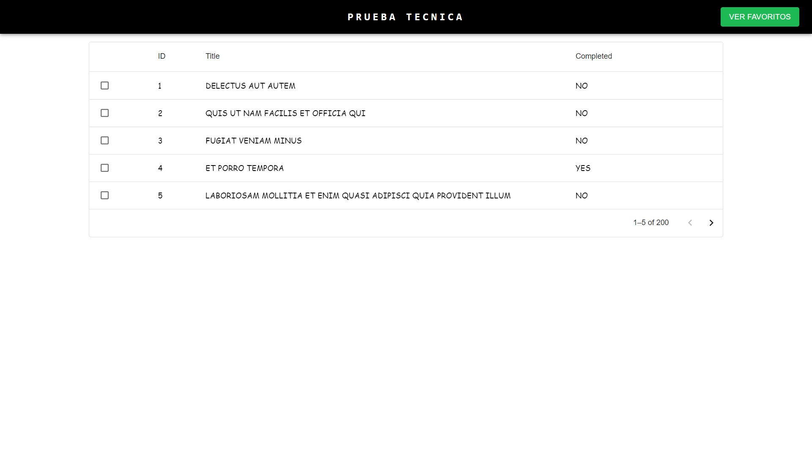
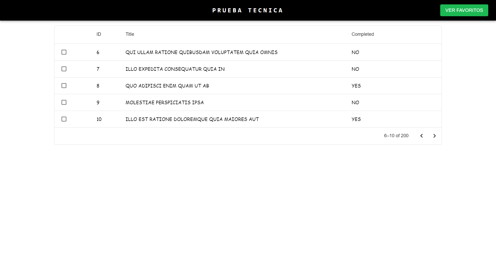
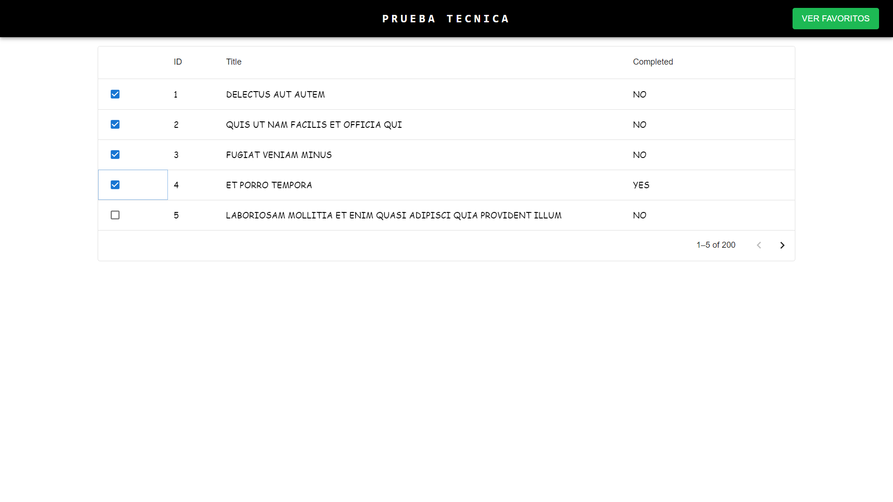
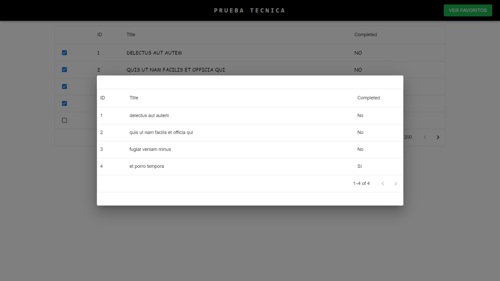
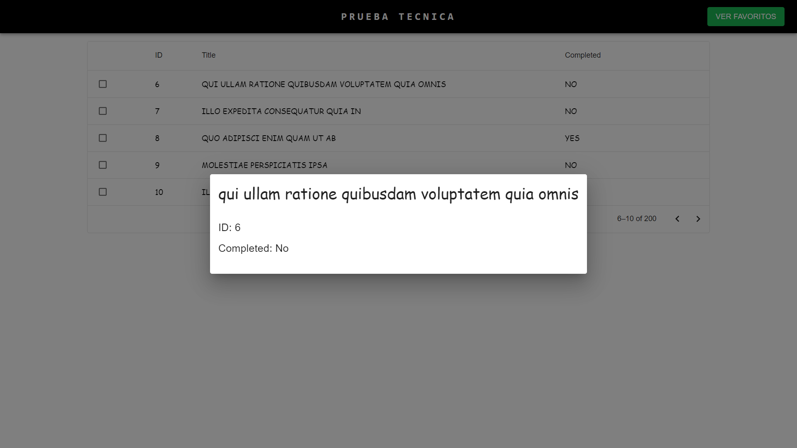

# Prueba Técnica para Desarrollador Frontend  SemiSenior

## Consigna 
La consigna esta al final del documento, clickea [aquí](#instrucciones) para ir.

## Como ejecutar la solución
- Clonar este repositorio
- Ejecutar dentro del proyecto **npm install**
- Luego de instalado de que se instalan las dependencias
ejecutar **npm start**

## Solución implementada

**Cargar los datos desde [JSONPlaceholder](https://jsonplaceholder.typicode.com/)**

Se cargan los datos de la API pública [JSONPlaceholder](https://jsonplaceholder.typicode.com/),
se utiliza Redux para guardar los datos de los posts levantados en local storage, y disponer
de los mismos. Se utiliza un componente Data Grid de la biblioteca mui, para mostrar los datos
y paginar los mismos, este componente también brinda la posibilidad de ordenar la tabla y filtrar
la misma por un dato determinado con una barra de búsqueda.

**Seleccionar favoritos**

A través de los check se agregan los posts a la sección de favoritos, esto también se hace utilizando redux,
que agrega los mismos a una variable de LocalStorage. Para ver a los favoritos se utiliza un modal (ventana
emergente), donde se ven todos los favoritos seleccionados los mismos se toman de la variable localStorage
con los favoritos agregados. Si se quita el check de los post de favoritos, los mismos se quitan de la
variable favoritos de localStorage y ya no se verían en la sección de favoritos 

**Ver información detallada de los posts**

Para ver la información de los posts, se puede clickear sobre el id, el titulo o la columna de completado
y se abrirá nuevamente una ventana emergente con la información del post seleccionado. Para hacer esto
se agrego la información de la fila seleccionada a una variable localStorage, directamente ya que
algo tan simple no amerita agregar una nueva sección a Redux y para agregar la funcionalidad para que se abra la ventana emergente se agrego un botón a cada elemento de la columna y se aplico el css, con sx por que el boton es parte del material ofrecido por la biblioteca de mui.

## Instrucciones

- **Duración:** 4 horas.
- **Requisitos:** Implementa una aplicación de una sola página (SPA) utilizando React.
- **Enfoque:** La aplicación debe consumir una API pública, mostrar los datos de manera organizada, y permitir la interacción del usuario con esos datos.

## Requisitos de la Aplicación

### Interfaz de Usuario

1. **Página Principal:**
   - Crea una página principal que muestre una lista de elementos recuperados de una API pública (puedes usar [JSONPlaceholder](https://jsonplaceholder.typicode.com/), [The Dog API](https://thedogapi.com/), u otra API de tu elección).
   - Cada elemento de la lista debe mostrar información clave como título, imagen (si está disponible), y una breve descripción.
   - Permite al usuario hacer clic en un elemento para ver más detalles en una página de detalles.

### Interacción del Usuario

1. **Barra de Búsqueda:**
   - Implementa una barra de búsqueda para filtrar los elementos mostrados en la lista principal.
2. **Favoritos:**
   - Permite al usuario marcar sus elementos favoritos y almacenar estos datos en el `localStorage`.
   - Crea una sección separada donde el usuario pueda ver sus elementos favoritos.

### Estilizado

1. **Diseño Responsivo:**
   - Usa CSS o una biblioteca de estilos como Material-UI, TailwindCSS, o styled-components para diseñar la aplicación.
   - Asegúrate de que la aplicación sea responsive, funcionando correctamente en dispositivos móviles y de escritorio.

### Manejo de Estado

1. **React Hooks:**
   - Utiliza React Hooks (`useState`, `useEffect`) para manejar el estado de la aplicación.
2. **Manejo de Estado Global (Opcional):**
   - Si te sientes cómodo, puedes utilizar una biblioteca de manejo de estado como Redux.

### Extras Opcionales

1. **Paginación:**
   - Implementa paginación en la lista principal si la API lo soporta.
2. **Animaciones:**
   - Añade animaciones para mejorar la experiencia de usuario.
3. **Manejo de Errores:**
   - Implementa manejo de errores para cuando la API no esté disponible o los datos no se puedan cargar.

## Entrega

1. **Repositorio GitHub:**
   - Sube el código a un repositorio público de GitHub.
2. **Instrucciones:**
   - Incluye un archivo `README.md` con instrucciones para ejecutar el proyecto y cualquier otra información relevante.
3. **Presentación:**
   - Asegúrate de que el código esté bien organizado, comentado y con buenas prácticas de desarrollo.

## Evaluación

1. **Funcionalidad:** La aplicación cumple con los requisitos y permite la interacción del usuario.
2. **Código:** Claridad, organización y uso adecuado de React y otras tecnologías.
3. **Diseño:** Estética, usabilidad y responsive design.
4. **Extras:** Implementación de funcionalidades adicionales como paginación, animaciones, y manejo de errores.
